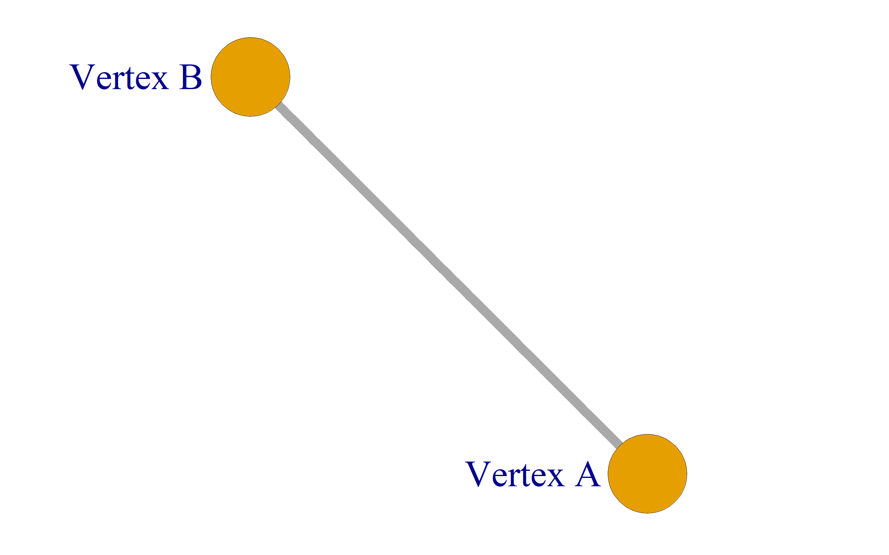
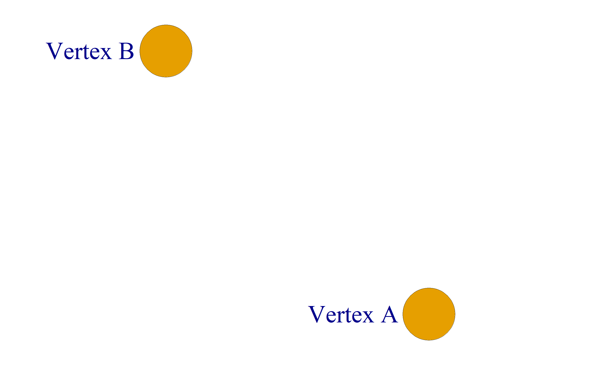
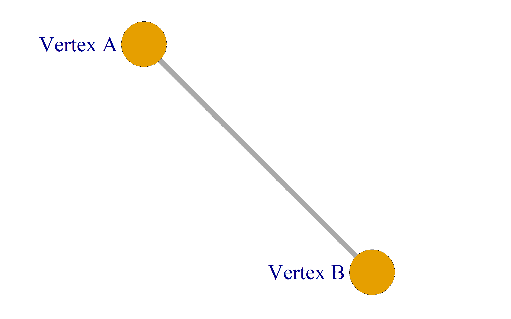
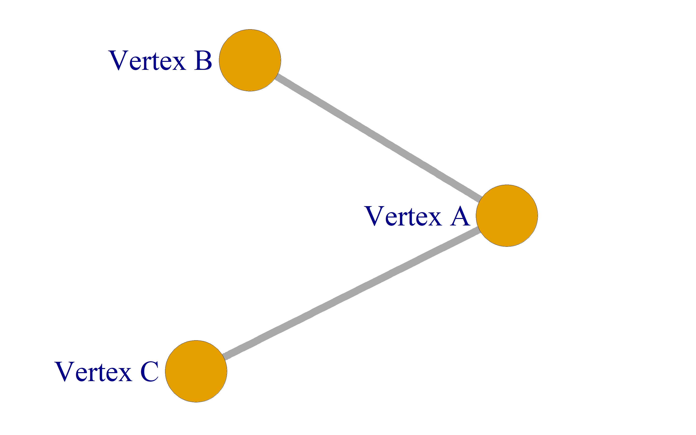
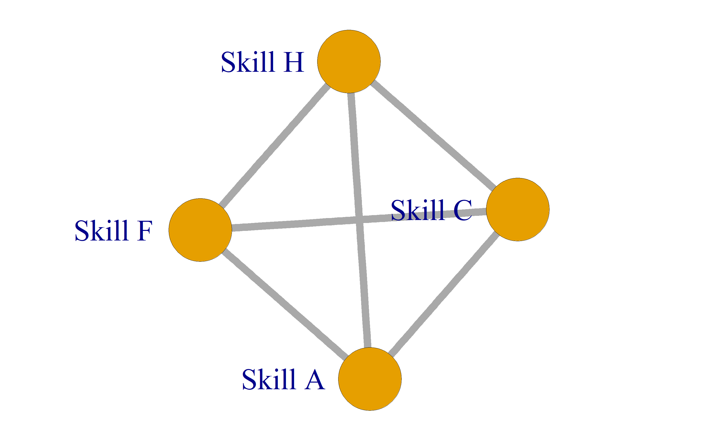
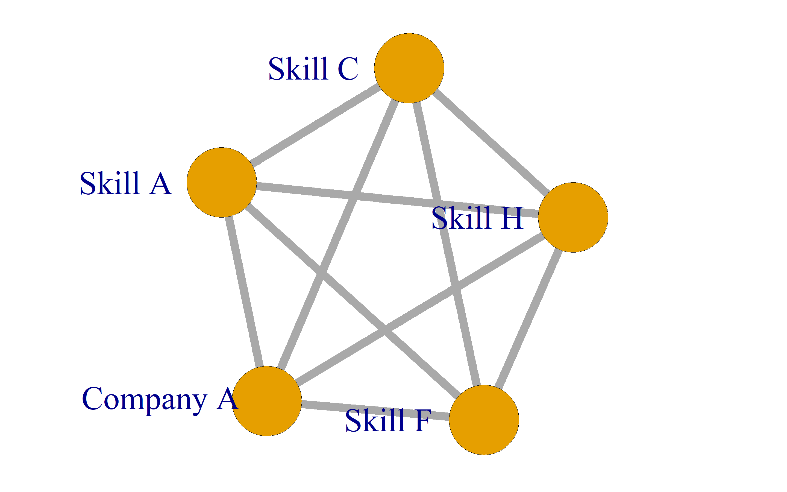
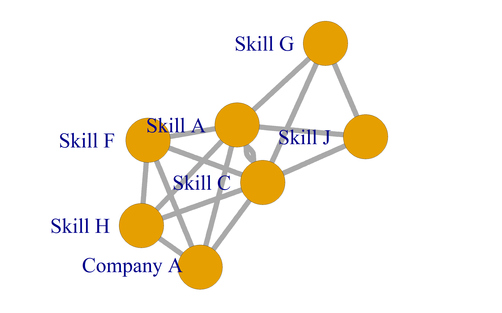
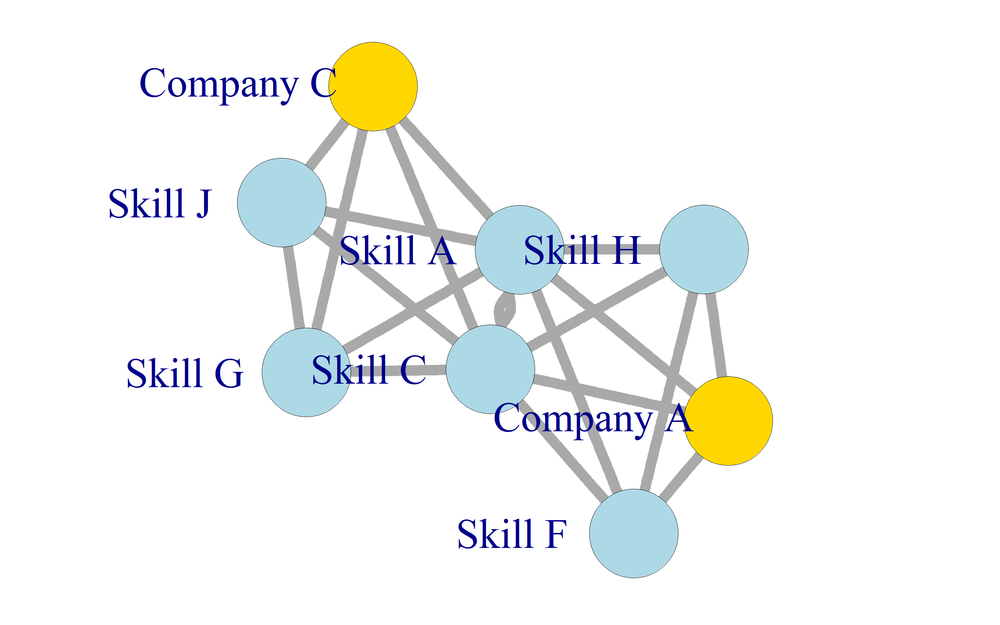

igraph
========================================================
author: Ken Bury
date: 8/28/2017
width: 1440
height: 900


What I will cover
========================================================

- Intro to graphs and the R package igraph
- My adventures in igraph
- Sites I found helpful

Graphs
========================================================
 - A graph in graph theory is defined by vertices and edges. The vertices are connected by edges.
 
 ***
 


The igraph package
========================================================

![alt text][id]

- The package is cross platform
- There are a ton of functions
- Appears to be actively maintained on Github

[id]: Rusers-figure/igraph.png "igraph"

The igraph package
========================================================

- My preference was to start with an empty graph and then add the vertices.


```r
library("igraph")
mygraph <- make_empty_graph(n = 0, directed = FALSE)
mygraph <- mygraph + vertices(c("Vertex A", "Vertex B"), type = "skill")
V(mygraph)$size <- 40.0
E(mygraph)$width <- 30.0
```
***

```r
plot(mygraph,  vertex.label.cex=10, vertex.label.dist = 2.5, vertex.label.degree=pi)
```


The igraph package
========================================================

- and then add the edges...


```r
mygraph <- mygraph + edge("Vertex A", "Vertex B")
V(mygraph)$size <- 40.0
E(mygraph)$width <- 30.0
```
***

```r
plot(mygraph,  vertex.label.cex=10, vertex.label.dist = 2.5, vertex.label.degree=pi)
```


The igraph package
========================================================

- and then add a vertex and some more edges


```r
mygraph <- mygraph + vertex("Vertex C", type = "company")
mygraph <- mygraph + edge("Vertex A", "Vertex C")
V(mygraph)$size <- 40.0
E(mygraph)$width <- 30.0
```
***

```r
plot(mygraph,  vertex.label.cex=10, vertex.label.dist = 2.5, vertex.label.degree=pi)
```



My Adventures in igraph
========================================================
- Analytics project with a member of the Human Resources team
- Objective was to see how companies and skills were related in a specific market
- Ideally the output was to look like an old Linkedin inMap which is no longer supported.

***

![alt text][id2]


[id2]: Rusers-figure/alisnetwork-1.jpg "inMap"

My Adventures in igraph
========================================================
- The data consisted of candidate records which had a company name and a set of skills
- The candidates were part of a defined set of companies and skills.
- There were 42000 candidates representing 48000 unique skills and 13000 unique companies

My Adventures in igraph
========================================================
- The network was developed by making vertices with each of the candidates skills and edges between them


```r
mygraph <- make_empty_graph(n = 0, directed = FALSE)
item_skills <- c("Skill A", "Skill F", "Skill C", "Skill H")
item_company <- c("Company A")
mygraph <- mygraph + vertices(item_skills, type = "skill")
if (length(item_skills)>1) {
 for (j in 1:(length(item_skills)-1)) {
   for (k in (j+1):length(item_skills)) {
     mygraph <- mygraph + edge(item_skills[j],item_skills[k])   } } }
V(mygraph)$size <- 40.0
E(mygraph)$width <- 30.0
```
***

```r
plot(mygraph,  vertex.label.cex=10, vertex.label.dist = 2.5, vertex.label.degree=pi)
```



My Adventures in igraph
========================================================
- Each of the skills are connected to the candidate's company


```r
if (length(item_skills)>0) {
     mygraph <- mygraph + vertex(item_company[1], type = "company")
     for (j in 1:length(item_skills)) {
       mygraph <- mygraph + edge(item_skills[j], item_company[1])     }   }
V(mygraph)$size <- 40.0
E(mygraph)$width <- 30.0
```
***

```r
plot(mygraph,  vertex.label.cex=10, vertex.label.dist = 2.5, vertex.label.degree=pi)
```


My Adventures in igraph
========================================================
- Do it again for each of the candidates


```r
item_skills2 <- c("Skill A", "Skill G", "Skill C", "Skill J")
item_company2 <- c("Company C")
mygraph <- mygraph + vertices(setdiff(item_skills2,item_skills), type = "skill")
if (length(item_skills2)>1) {
 for (j in 1:(length(item_skills2)-1)) {
   for (k in (j+1):length(item_skills2)) {
     mygraph <- mygraph + edge(item_skills2[j],item_skills2[k])   } } }
V(mygraph)$size <- 40.0
E(mygraph)$width <- 30.0
```
***

```r
plot(mygraph,  vertex.label.cex=10, vertex.label.dist = 2.5, vertex.label.degree=pi)
```



My Adventures in igraph
========================================================
- I didn't code it like this but this is the way I added candidate information


```r
if (length(item_skills2)>0) {
     mygraph <- mygraph + vertex(item_company2[1], type = "company")
     for (j in 1:length(item_skills2)) {
       mygraph <- mygraph + edge(item_skills2[j], item_company2[1])     }   }
V(mygraph)$size <- 40.0
E(mygraph)$width <- 30.0
V(mygraph)$color[which(V(mygraph)$type == "skill")] <- "light blue"
V(mygraph)$color[which(V(mygraph)$type == "company")] <- "gold"
```
***

```r
plot(mygraph,  vertex.label.cex=10, vertex.label.dist = 2.5, vertex.label.degree=pi)
```


My Adventures in igraph
========================================================
- I had to develop a strategy to reduce the skills and the companies

  1. A candidate had to have one of the base set of skills to be selected
  2. The candidates skills needed to be in the top 1000 relevant skills
  3. The resulting candidates were from over 5000 unique companies
  4. The candidates were reduced to the ones coming from the top 50 companies and the seed companies not in the top 50

- This resulted in over 6000 candidates from 55 companies, those candidates had 208 unique skills.

My Adventures in igraph
========================================================
- Developing the network took about an hour on a Core i7-6700 3.4 GHz, 16 GB RAM 

- __Over 300,000 edges were produced!!!__

My Adventures in igraph
========================================================
left: 30%
- This was the graph after the edges were consolidated and a corresponding edge weight was computed
- The graph uses the Fruchterman-Reingold layout algorithm with edge weights
- There are 263 vertices, well over the 100 vertices that considered too many to display, aka hairball
- It was clear enough that we could make out potential communities 

***
![alt text][id3]


[id3]: Rusers-figure/network.png "Network"

My Adventures in igraph
========================================================
left: 30%
- This is the graph with the spin-glass model communities colored in
- The vertices are in the same location just the colors were changed 

***
![alt text][id4]


[id4]: Rusers-figure/network2.png "Network2"

My Adventures in igraph
========================================================
- We were asked to generate graph ranking metrics

***
![alt text][id5]


[id5]: Rusers-figure/toprank.png "toprank"

My Adventures in igraph
========================================================
- Once the graph was produced the analysis functions were fast
- We tried the graphvis package but it was way too slow to handle the whole graph

Sites I found helpful
========================================================

[Practical statistical network analysis (with R and igraph) PDF][id]  
[Statistical Analysis of Network Data PDF][id6]  
[Network Analysis and Visualization with R and igraph][id2]  
[Using the iGraph package to Analyse the Enron Corpus][id3]  
[R igraph manual pages][id5]

[Contact: Ken Bury on Linkedin][id4]


[id]: http://statmath.wu.ac.at/research/friday/resources_WS0708_SS08/igraph.pdf
[id2]: http://kateto.net/networks-r-igraph
[id3]: http://r.prevos.net/analyse-enron-corpus/
[id4]: https://www.linkedin.com/in/kenbury/
[id5]: http://igraph.org/r/doc/
[id6]: math.bu.edu/ness12/ness2012-shortcourse-kolaczyk.pdf

